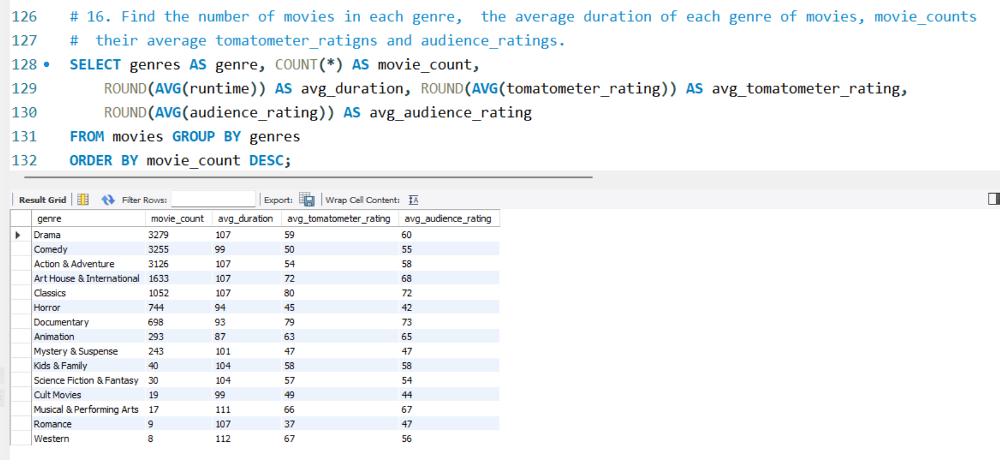
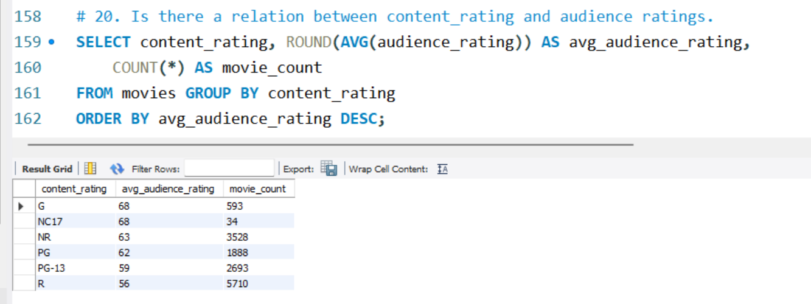

# SQL Case Study on Movie Dataset

## Introduction

This repository contains a SQL case study focusing on a movie dataset sourced from [Kaggle](https://www.kaggle.com/datasets/stefanoleone992/rotten-tomatoes-movies-and-critic-reviews-dataset?select=rotten_tomatoes_movies.csv). The dataset provides detailed information about movies, including various metrics on critic and audience ratings.

## Dataset

### Description

The dataset contains comprehensive details about movies available on Rotten Tomatoes, including information on critic reviews, audience ratings, and movie attributes.

### Columns

- `rotten_tomatoes_link`: URL to the Rotten Tomatoes page for the movie
- `movie_title`: Title of the movie
- `movie_info`: Additional information about the movie
- `critics_consensus`: Consensus summary from critics
- `content_rating`: Content rating of the movie
- `genres`: Genres of the movie
- `directors`: Directors of the movie
- `authors`: Authors of the movie (e.g., screenplay writers)
- `actors`: Actors in the movie
- `original_release_date`: Original release date of the movie
- `streaming_release_date`: Date when the movie was made available for streaming
- `runtime`: Duration of the movie in minutes
- `production_company`: Production company that produced the movie
- `tomatometer_status`: Status of the Tomatometer (e.g., Fresh, Rotten)
- `tomatometer_rating`: Rating given by critics (Tomatometer score)
- `tomatometer_count`: Total number of critic reviews
- `audience_status`: Status of the audience rating
- `audience_rating`: Rating given by the audience
- `audience_count`: Number of audience reviews
- `tomatometer_top_critics_count`: Number of reviews from top critics
- `tomatometer_fresh_critics_count`: Number of fresh critic reviews
- `tomatometer_rotten_critics_count`: Number of rotten critic reviews

## SQL Case Study

### Objectives

The SQL case study aims to:
- Analyze the distribution of movie ratings across different genres.
- Compare critic ratings with audience ratings.
- Identify trends in movie ratings over time.
- Explore the relationship between critic reviews and the `tomatometer` rating.

### Approach

1. **Data Cleaning**: Handle missing values and inconsistencies in the dataset.
2. **Data Analysis**: Write SQL queries to extract insights from the dataset.
3. **Visualization**: Generate reports and visualizations based on the SQL query results (if applicable).

## SQL Queries and Findings

### 1. Movies with the Highest Tomatometer Rating

**Query:**
```sql
SELECT movie_title, tomatometer_rating 
FROM movies 
WHERE tomatometer_rating = 100;
```

## Visualization

<p float="left">
  
  
</p>


## Findings
- Out of 14446 movies only 542 movies have 100% ratings that is only 4% of all the movies released.

### 2. Find top 10 movies which have highest both tomatometer_rating and audience_rating.

**Query:**
```sql
SELECT movie_title, tomatometer_rating, audience_rating , 
ROUND((tomatometer_rating+audience_rating)/2,1) AS average_rating
FROM movies 
ORDER BY average_rating DESC LIMIT 10;
```

## Visualization

<p float="left">
  
  
</p>


## Findings
- All the relevant information related to the question can found from the table itself.

### 3. How many movies out of total have tomatometer_rating more than the average_tomatometer_ratings.

**Query:**
```sql
with cte as(
SELECT COUNT(*) AS total_movies, ROUND(AVG(tomatometer_rating),2) AS average_ratings,
SUM(CASE 
	WHEN tomatometer_rating > (SELECT AVG(tomatometer_rating) FROM movies) THEN 1 
	ELSE 0 
    END) AS more_than_avg
FROM movies) 
SELECT total_movies, average_ratings,  more_than_avg, 
ROUND((more_than_avg/total_movies)*100,2) AS movies_percentage_more_than_avg 
FROM cte;
```

## Visualization

<p float="left">
  
  
</p>>


## Findings
- 35% of all the movies have ratings more than the average ratings.


### 4. Find the top 10 longest movie  and top 10 shortest movie and compare their tomatometer_ratings as well as audience_rating.

**Query:**
```sql
(SELECT movie_title, runtime, tomatometer_rating, audience_rating 
    FROM movies ORDER BY runtime DESC LIMIT 10)
UNION ALL
(SELECT movie_title, runtime, tomatometer_rating, audience_rating 
	FROM movies ORDER BY runtime ASC LIMIT 10);
```

## Visualization

<p float="left">
  
  
</p>>


## Findings
- All the relevant insights related to the question can found from the table itself.


### 5. Find movies which have highest tomatometer_ratings and where tomatometer_top_critic counts is more than 65.

**Query:**
```sql
SELECT movie_title, runtime, tomatometer_rating, audience_rating, tomatometer_top_critics_count
	FROM movies WHERE tomatometer_top_critics_count >65
    ORDER BY tomatometer_rating DESC;
```

## Visualization

<p float="left">
  
  
</p>>


## Findings
- All the relevant insights related to the question can found from the table itself.

### 6. Find the TOP 20 movie for which the difference between original_release_date and streaming_release_date is maximum in months.

**Query:**
```sql
SELECT movie_title, runtime, tomatometer_rating, original_release_date, streaming_release_date,
ABS(timestampdiff(YEAR, streaming_release_date, original_release_date)) AS time_diff 
	FROM movies 
    ORDER BY time_diff  DESC LIMIT 20;
```

## Visualization

<p float="left">
  
  
</p>>


## Findings
- All the relevant insights related to the question can found from the table itself.

### 7. Find all the movies made by top three director who have made atleast 10 movies in terms of tomatometer_ratings.
**Query:**
```sql
WITH CTE AS(
SELECT lead_director, COUNT(*) as movie_count, ROUND(AVG(tomatometer_rating),2) as avg_rating FROM movies 
GROUP BY lead_director 
HAVING movie_count > 10 ORDER BY AVG(tomatometer_rating) DESC LIMIT 3)
SELECT movie_title, runtime, tomatometer_rating, audience_rating, lead_director
FROM movies WHERE lead_director IN (SELECT lead_director FROM CTE);
```

## Visualization

<p float="left">
  
  
</p>>


## Findings
- Director Akira Kurosawa has the highest ratings whereas William Wyler has made most number of movies with good ratings.


### 8. Find the best movie of each year in terms of ratings.
**Query:**
```sql
WITH ranked_movies AS (
    SELECT movie_title, original_release_date, average_rating, genres,
        YEAR(original_release_date) AS release_year,
        ROW_NUMBER() OVER (PARTITION BY YEAR(original_release_date) ORDER BY average_rating DESC) AS ranking
    FROM movies)
SELECT movie_title,  original_release_date, average_rating , genres
FROM ranked_movies WHERE ranking = 1;
```

## Visualization

<p float="left">
  
  
</p>>


## Findings
- Out of 105 years of movie data, for about 35 years, the genre 'Art House & International' has produced the best movies.
- The genres 'Western' and 'Musical & Performing Arts' each have the best movie for only one year.

### 9. What are the top 5 actors in terms of audience ratings with at least 10 movies.
**Query:**
```sql
SELECT lead_actor, ROUND(AVG(audience_rating),2) AS avg_rating, COUNT(*) AS movie_count
    FROM movies
    GROUP BY lead_actor
    HAVING movie_count >= 10 ORDER BY avg_rating DESC LIMIT 5;
```

## Visualization

<p float="left">
  
  
</p>>


## Findings
- All the relevant insights related to the question can found from the table  and chart shown above.

### 10. Find number of movies done by each actor and their average audience rating.
**Query:**
```sql
SELECT lead_actor, COUNT(*) AS movie_count, ROUND(AVG(audience_rating),2) AS avg_rating
FROM movies GROUP BY lead_actor ORDER BY movie_count DESC;
```

## Visualization

<p float="left">
  
  
</p>>


## Findings
- All the relevant insights related to the question can found from the table itself.


### 11. Find number of movies directed by each director and thier average rating.
**Query:**
```sql
SELECT lead_director, COUNT(*) AS movie_count, ROUND(AVG(average_rating),2) AS avg_rating
FROM movies GROUP BY lead_director ORDER BY movie_count DESC;
```

## Visualization

<p float="left">
  
  
</p>>


## Findings
- All the relevant insights related to the question can found from the table itself.

### 12. Find the month each year with most number of movies.
**Query:**
```sql
WITH monthly_movie_counts AS (
    SELECT YEAR(original_release_date) AS release_year, MONTHNAME(original_release_date) AS release_month,
        COUNT(*) AS movie_count
    FROM movies GROUP BY release_year, release_month
), 
ranked_months AS ( SELECT release_year, release_month, movie_count,
        ROW_NUMBER() OVER (PARTITION BY release_year ORDER BY movie_count DESC) AS ranking
    FROM monthly_movie_counts )
SELECT 
    release_year, release_month, movie_count FROM ranked_months WHERE ranking = 1
ORDER BY release_year DESC;
```

## Visualization

<p float="left">
  
  
</p>>


## Findings
- Most number of movies are released in the month of January and no movies are released in the month of july.

### 13.Find the report chard of top 10 actors by audience count. 
**Query:**
```sql
 SELECT lead_actor, ROUND(AVG(tomatometer_rating)) AS avg_tomatometer_rating,
	ROUND(AVG(tomatometer_count)) AS avg_tomatometer_count,
    ROUND(AVG(audience_rating)) AS avg_audience_rating,
    ROUND(AVG(audience_count)) AS avg_audience_count,
	COUNT(*) AS movie_count
    FROM movies
    GROUP BY lead_actor ORDER BY avg_audience_count DESC LIMIT 10;
```

## Visualization

<p float="left">
  
 
</p>>


## Findings
- All the relevant insights related to the question can found from the table itself.

### 14. Is there a relationship between genres and average audience_ratings.
**Query:**
```sql
SELECT genres, ROUND(AVG(audience_rating)) as avg_ratings FROM movies
GROUP BY genres ORDER BY avg_ratings DESC;
```

## Visualization

<p float="left">
  
  
</p>>


## Findings
- Documentary movies have the highest ratings and horror movies have the least ratings.

### 15. How many movies released on each day of the week.
**Query:**
```sql
with cte as(
SELECT DAYOFWEEK(original_release_date) as day_of_week, COUNT(*) AS movie_counts FROM movies 
GROUP BY DAYOFWEEK(original_release_date))
SELECT CASE  WHEN day_of_week = 1 THEN 'Sunday' 
            WHEN day_of_week =2 THEN 'Monday'
            WHEN day_of_week =3 THEN 'Tuesday'
            WHEN day_of_week =4 THEN 'Wednesday'
            WHEN day_of_week =5 THEN 'Thursday'
            WHEN day_of_week =6 THEN 'Friday'
            WHEN day_of_week =7 THEN 'Saturday'
        END AS day_name, movie_counts FROM cte ORDER BY movie_counts DESC;
        
```

## Visualization

<p float="left">
  
 
</p>>   
  

## Findings
- All the relevant insights related to the question can found from the table itself.

### 16. Find the number of movies in each genre,  the average duration of each genre of movies, movie_counts their average tomatometer_ratigns and audience_ratings.
**Query:**
```sql
SELECT genres AS genre, COUNT(*) AS movie_count,
    ROUND(AVG(runtime)) AS avg_duration, ROUND(AVG(tomatometer_rating)) AS avg_tomatometer_rating,
    ROUND(AVG(audience_rating)) AS avg_audience_rating
FROM movies GROUP BY genres
ORDER BY movie_count DESC;
        
```

## Visualization

<p float="left">
  
 
</p>>   
  

## Findings
- All the relevant insights related to the question can found from the table itself.

### 17. Compare TOP 10 production companies in terms of number of movies and ratings.
**Query:**
```sql
SELECT 
    production_company, COUNT(*) AS movie_count,
    ROUND(AVG(tomatometer_rating)) AS avg_tomatometer_rating,
    ROUND(AVG(audience_rating)) AS avg_audience_rating
FROM movies GROUP BY production_company 
ORDER BY movie_count DESC, avg_tomatometer_rating DESC, avg_audience_rating DESC LIMIT 10;
        
```

## Visualization

<p float="left">
  
 
</p>>   
  

## Findings
- All the relevant insights related to the question can found from the table itself.

###  18. Find 10 movies which have largest difference in the scores between tomatometer ratings and audience ratings.
**Query:**
```sql
SELECT movie_title, tomatometer_rating, tomatometer_count, audience_rating, audience_count,
    ABS(tomatometer_rating - audience_rating) AS rating_difference
FROM  movies WHERE tomatometer_rating > 0 AND audience_count> 1000
ORDER BY rating_difference DESC LIMIT 10;
```

## Visualization

<p float="left">
  
 
</p>>   
  

## Findings
- All the relevant insights related to the question can found from the table itself.

###  19. Find top 10 combination of director, actor and author which will produce a hit movies.
**Query:**
```sql
SELECT 
    lead_director, lead_actor, lead_author, COUNT(*) AS movie_count,
    ROUND(AVG(tomatometer_rating)) AS avg_tomatometer_rating,
    rOUND(AVG(audience_rating)) AS avg_audience_rating,
    ROUND(AVG(average_rating))  AS avg_combined_rating
FROM movies GROUP BY lead_director, lead_actor, lead_author
HAVING  movie_count > 1 ORDER BY avg_combined_rating DESC, movie_count DESC
LIMIT 10;
```

## Visualization

<p float="left">
  
 
</p>>   
  

## Findings
- All the relevant insights related to the question can found from the table itself.

###  20. Is there a relation between content_rating and audience ratings.
**Query:**
```sql
SELECT content_rating, ROUND(AVG(audience_rating)) AS avg_audience_rating,
    COUNT(*) AS movie_count
FROM movies GROUP BY content_rating
ORDER BY avg_audience_rating DESC;
```

## Visualization

<p float="left">
  
 
</p>>   
  

## Findings
- All the relevant insights related to the question can found from the table itself.

# Conclusion
This project demonstrates the use of SQL queries to analyze movie data from Rotten Tomatoes. The insights gained from the analysis offer valuable information on movie ratings, genres, and industry trends, providing a deeper understanding of film performance and audience preferences over time.

Feel free to explore the code and documentation provided in this repository to gain a deeper understanding of the project and replicate the results and if you have any questions or suggestions, please don't hesitate to reach out on this [email](jabcd.1997@gmail.com)

Happy Exploring!
